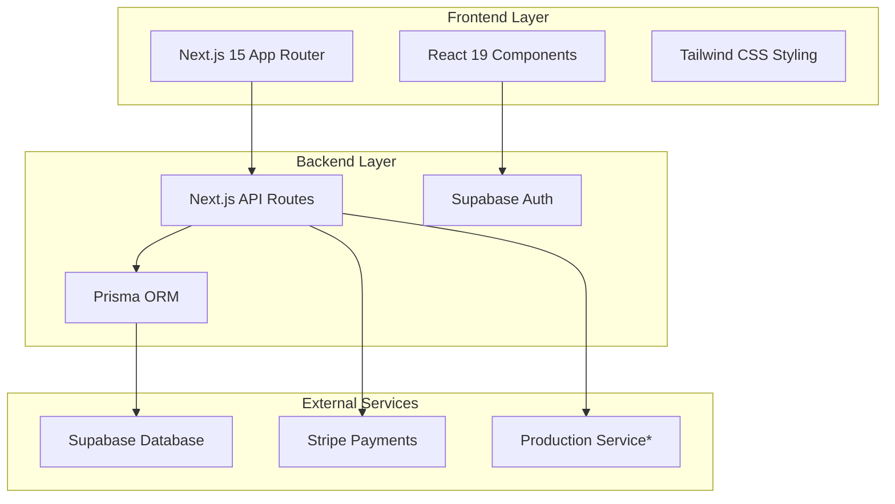
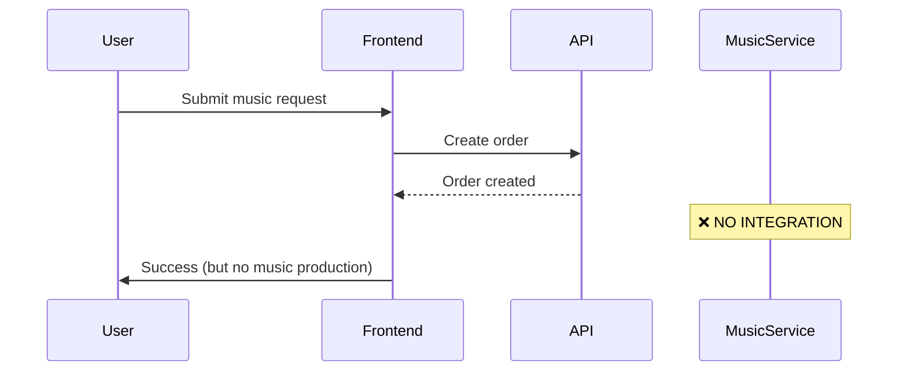
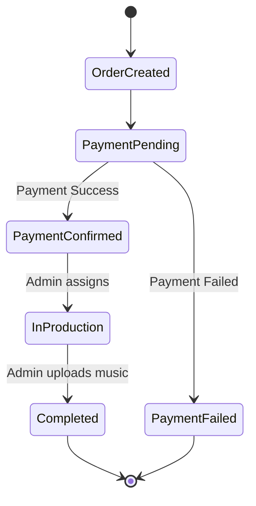

# Revisão do Projeto e Plano de Melhoria para Lançamento do MVP

## Visão Geral

Este documento fornece uma análise abrangente do projeto turuturu-app e recomendações práticas para deploy rápido do MVP. O projeto é uma plataforma de criação musical baseada em Next.js que permite aos usuários encomendar músicas infantis personalizadas.

**Status Atual**: Funcionalidades completas mas requer otimização para lançamento rápido no mercado.

## Avaliação do Projeto

### Análise da Arquitetura

O projeto segue uma arquitetura moderna de **Aplicação Full-Stack** com:



### Avaliação da Stack Tecnológica

| Componente | Atual | Status | Prontidão MVP |
|-----------|---------|--------|---------------|
| **Frontend** | Next.js 15.5.2 + React 19 | ✅ Excelente | Pronto para Produção |
| **Estilização** | Tailwind CSS v4 | ✅ Moderno | Pronto para Produção |
| **Banco de Dados** | PostgreSQL + Prisma 6.15 | ✅ Robusto | Pronto para Produção |
| **Autenticação** | Supabase Auth | ✅ Enterprise | Pronto para Produção |
| **Pagamentos** | Stripe | ✅ Padrão da Indústria | Pronto |
| **Deploy** | Não Configurado | ❌ Ausente | **Lacuna Crítica** |

## Problemas Críticos para Lançamento do MVP

### 🚨 Alta Prioridade (Bloqueadores de Lançamento)

#### 1. Lógica de Negócio Central Ausente
**Problema**: Nenhuma integração real de API para criação musical


**Solução**: Implementar integração com serviço de geração musical ou sistema de workflow manual.

#### 2. Fluxo de Pagamento Incompleto
**Problema**: Integração Stripe existe mas processamento de pagamento não está implementado
- Sem handlers de webhook para confirmação de pagamento
- Sem atualizações de status do pedido após pagamento
- Sistema de compra de créditos incompleto

#### 3. Configuração de Deploy em Produção Ausente
**Problema**: Nenhuma configuração de deploy para lançamento imediato
- Sem configuração de ambiente para produção
- Sem pipeline CI/CD
- Banco de dados não otimizado para carga de produção

#### 4. Vulnerabilidades de Segurança
**Problema**: Segredos de produção expostos no repositório
```
⚠️  CRÍTICO: Credenciais do banco de dados commitadas no git
📁 .env.local contém URLs de banco de produção
🔓 Nenhuma separação de ambiente entre dev/prod
```

### ⚠️ Prioridade Média (Otimizações de Lançamento)

#### 1. Problemas de Performance
- Nenhuma estratégia de otimização de imagens
- Nenhuma implementação de cache
- Tamanho grande do bundle JavaScript (React 19 + Turbopack experimental)

#### 2. Lacunas na Experiência do Usuário
- Nenhum sistema de notificações por email
- Tratamento de erros e feedback limitados
- Nenhum rastreamento de pedidos além do dashboard

#### 3. Funcionalidades Administrativas Ausentes
- Nenhum painel admin para gerenciamento de pedidos
- Nenhum sistema de upload de arquivos de música para pedidos concluídos
- Nenhuma ferramenta de suporte ao cliente

## Estratégia de Lançamento do MVP

### Fase 1: Preparação Imediata para Lançamento (1-2 semanas)

#### Configuração de Segurança e Ambiente
```bash
# Environment Variables Restructure
NEXT_PUBLIC_SUPABASE_URL=your_supabase_url
NEXT_PUBLIC_SUPABASE_ANON_KEY=your_anon_key
DATABASE_URL=production_db_url
DIRECT_URL=production_direct_url
STRIPE_PUBLISHABLE_KEY=pk_live_...
STRIPE_SECRET_KEY=sk_live_...
STRIPE_WEBHOOK_SECRET=whsec_...
ADMIN_EMAIL=admin@yourdomain.com
```

#### Configuração de Deploy Rápido
```yaml
# vercel.json (recommended platform)
{
  "functions": {
    "app/api/**/*.js": {
      "maxDuration": 30
    }
  },
  "env": {
    "DATABASE_URL": "@database_url",
    "STRIPE_SECRET_KEY": "@stripe_secret"
  }
}
```

#### Implementação de Endpoints de API Essenciais
```typescript
// Priority API endpoints to implement:
// 1. POST /api/stripe/create-payment-intent
// 2. POST /api/stripe/webhook (payment confirmation)
// 3. POST /api/orders/update-status (admin)
// 4. POST /api/music/upload (admin)
```

### Fase 2: Implementação da Lógica de Negócio (1 semana)

#### Workflow Manual de Produção Musical
Como a geração automática de música é complexa, implementar workflow manual:



#### Requisitos do Dashboard Admin
- Gerenciamento de fila de pedidos
- Sistema de upload de arquivos de música
- Ferramentas de comunicação com cliente
- Rastreamento de pagamentos

### Fase 3: Otimizações de Produção (1 semana)

#### Otimizações de Performance
```typescript
// next.config.ts improvements
const nextConfig: NextConfig = {
  experimental: {
    turbo: {
      rules: {
        '*.svg': {
          loaders: ['@svgr/webpack'],
          as: '*.js',
        },
      },
    },
  },
  images: {
    domains: ['your-storage-domain.com'],
    formats: ['image/webp', 'image/avif'],
  },
  compress: true,
};
```

#### Otimizações de Banco de Dados
```sql
-- Essential indexes for production
CREATE INDEX CONCURRENTLY idx_orders_customer_status 
ON "Order"(customerId, status);

CREATE INDEX CONCURRENTLY idx_orders_created_at 
ON "Order"(createdAt DESC);

-- RLS Policies for Supabase
ALTER TABLE "Profile" ENABLE ROW LEVEL SECURITY;
ALTER TABLE "Order" ENABLE ROW LEVEL SECURITY;
```

## Melhorias Tecnológicas Recomendadas

### 1. Substituir Dependências Experimentais
```json
{
  "devDependencies": {
    "next": "15.1.0",        // Stable version
    "tailwindcss": "^3.4.0", // Stable v3 instead of v4 beta
    "turbopack": "remove"     // Use webpack for production stability
  }
}
```

### 2. Adicionar Dependências Essenciais de Produção
```json
{
  "dependencies": {
    "@vercel/analytics": "^1.0.0",
    "@sentry/nextjs": "^7.0.0",
    "nodemailer": "^6.9.0",
    "sharp": "^0.33.0"
  }
}
```

### 3. Implementar Monitoramento e Observabilidade
```typescript
// lib/monitoring.ts
import * as Sentry from "@sentry/nextjs";

export const initMonitoring = () => {
  Sentry.init({
    dsn: process.env.SENTRY_DSN,
    tracesSampleRate: 0.1,
  });
};
```

## Plano de Implementação Rápida do MVP

### Semana 1: Infraestrutura Central
| Dia | Tarefa | Responsável | Prioridade |
|-----|--------|-------------|------------|
| 1-2 | Segurança de ambiente e configuração de deploy | DevOps | 🚨 Crítico |
| 3-4 | Finalização da integração de pagamento Stripe | Backend | 🚨 Crítico |
| 5-7 | MVP do dashboard admin | Frontend | ⚠️ Alto |

### Semana 2: Lógica de Negócio
| Dia | Tarefa | Responsável | Prioridade |
|-----|--------|-------------|------------|
| 1-3 | Workflow manual de produção musical | Backend | 🚨 Crítico |
| 4-5 | Sistema de notificação por email | Backend | ⚠️ Alto |
| 6-7 | Testes e correção de bugs | QA | ⚠️ Alto |

### Semana 3: Preparação para Lançamento
| Dia | Tarefa | Responsável | Prioridade |
|-----|--------|-------------|------------|
| 1-2 | Otimização de performance | DevOps | Médio |
| 3-4 | Teste de aceitação do usuário | Produto | ⚠️ Alto |
| 5-7 | Deploy em produção e monitoramento | DevOps | 🚨 Crítico |

## Avaliação de Débito Técnico

### Débito Técnico de Alto Impacto
1. **Gerenciamento de Estado de Autenticação**: Atualmente espalhado pelos componentes
2. **Tratamento de Erros**: Padrões inconsistentes de tratamento de erros
3. **Segurança de Tipos**: Faltam tipos TypeScript adequados para respostas de API
4. **Testes**: Nenhuma cobertura de testes (0% atualmente)

### Ganhos Rápidos para Débito Técnico
```typescript
// 1. Centralized auth context
export const AuthProvider = ({ children }) => {
  // Centralized auth state management
};

// 2. Standardized error handling
export const apiErrorHandler = (error: unknown) => {
  // Consistent error handling
};

// 3. API response types
export interface ApiResponse<T> {
  data?: T;
  error?: string;
  success: boolean;
}
```

## Otimização de Custos e Recursos

### Custos de Infraestrutura (Estimativas Mensais)
- **Vercel Pro**: $20/mês
- **Supabase Pro**: $25/mês  
- **Processamento Stripe**: 2,9% + $0,30 por transação
- **Domínio e SSL**: $15/ano

### Alocação de Recursos de Desenvolvimento
- **1 Desenvolvedor Full-stack**: 3 semanas tempo integral
- **1 Engenheiro DevOps**: 1 semana meio período
- **1 Gerente de Produto**: Coordenação contínua

## Estratégias de Mitigação de Riscos

### Riscos Técnicos
1. **Estabilidade do Next.js 15**: Monitorar problemas em produção, ter plano de rollback
2. **Processamento de Pagamentos**: Implementar validação abrangente de webhooks
3. **Performance do Banco de Dados**: Configurar monitoramento e otimização de queries

### Riscos de Negócio
1. **Produção Manual de Música**: Implementar gerenciamento de fila e rastreamento de SLA
2. **Suporte ao Cliente**: Preparar FAQ e sistema de tickets de suporte
3. **Escalabilidade**: Projetar para crescimento mas implementar gradualmente

## Métricas de Sucesso para MVP

### KPIs Técnicos
- **Tempo de Carregamento da Página**: < 2 segundos
- **Tempo de Resposta da API**: < 500ms
- **Taxa de Erro**: < 1%
- **Uptime**: 99,9%

### KPIs de Negócio
- **Taxa de Conclusão de Pedidos**: > 95%
- **Taxa de Sucesso de Pagamentos**: > 98%
- **Satisfação do Cliente**: > 4,5/5
- **Tempo para Entrega da Música**: < 24 horas

## Estratégia de Testes

### Testes Essenciais para MVP
```typescript
// 1. API Integration Tests
describe('Order Creation Flow', () => {
  test('should create order with valid data');
  test('should deduct credits correctly');
  test('should handle payment webhook');
});

// 2. Authentication Tests
describe('User Authentication', () => {
  test('should authenticate with email/password');
  test('should handle Google OAuth');
  test('should protect admin routes');
});

// 3. End-to-End Critical Path
test('Complete user journey: signup → order → payment → delivery');
```

## Conclusão

O projeto turuturu-app tem uma base técnica sólida mas requer esforço focado na implementação da lógica de negócio e deploy em produção para lançamento rápido do MVP. O cronograma recomendado de 3 semanas é agressivo mas alcançável com priorização adequada de funcionalidades críticas sobre otimizações desejáveis.

**Fatores-Chave de Sucesso:**
1. Implementar workflow manual de produção musical primeiro
2. Integração segura de processamento de pagamentos
3. Deploy com monitoramento desde o primeiro dia
4. Foco na jornada central do usuário sobre funcionalidades avançadas

A arquitetura suporta escalabilidade, então funcionalidades adicionais podem ser adicionadas pós-MVP baseadas no feedback do usuário e requisitos de negócio.